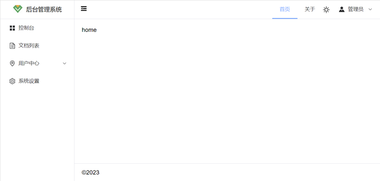
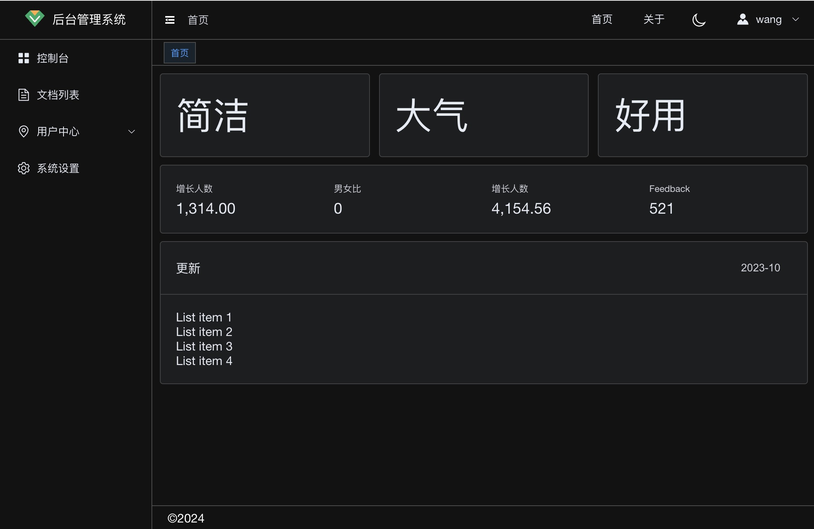

# vue-admin

## 技术栈

vue3 + vite + typescript + element-plus + pinia + vue-router + axios

## DEMO

[http://demo.cncf.vip/vue-admin/](http://demo.cncf.vip/vue-admin/)

## 界面

### 正常模式



### 暗模式



## 使用

### 安装依赖

```sh
pnpm i
```

### 启动 dev

```sh
pnpm dev
```

### 浏览器打开

http://localhost:5173/
