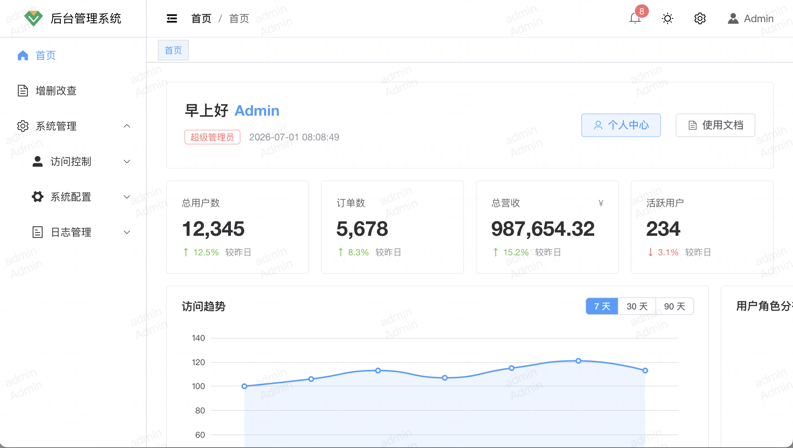
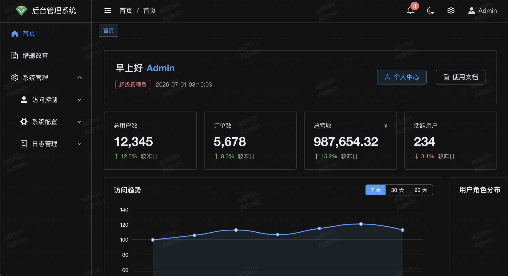

[](https://github.com/vue-admin/vue-admin/blob/main/LICENSE)
[](https://github.com/vue-admin/vue-admin/actions/workflows/ci.yml)
[](https://codecov.io/gh/vue-admin/vue-admin)
[](https://nodejs.org/)
[](https://pnpm.io/)
[](https://vuejs.org/)
[](https://vitejs.dev/)

# Vue Admin

> Vue 3 + Element Plus 企业级后台管理前端基座。开箱即用的权限系统、HTTP 客户端、路由守卫与开发工作流，可作为中后台项目的起点。

## ✨ 特性

### 架构与工程化

- 🏗️ **四层架构**（`lib` / `app` / `modules` / `shared`），由 ESLint `no-restricted-imports` 强制单向依赖
- 🎯 **目录扁平**，业务页面按领域聚合，单文件不超过 500 行
- 🧪 **Vitest 3 + jsdom + @vue/test-utils** 测试栈
- 🔍 **ESLint 9 flat config**，集成 Vue / TypeScript / Import 插件
- 🪝 **Husky + lint-staged + commitlint**，提交前自动校验

### 权限与认证

- 🔐 **JWT 认证**：`authService` 单例 + 并发刷新保护（复用 `refreshPromise`）+ 可插拔 `TokenStorage`
- 🛡️ **RBAC 权限模型**：`v-permission` 指令（不匹配时 DOM 移除）+ 4 步全局路由守卫
- ⚡ **超级管理员短路**：`isSuperAdmin` 命中时直接放行，避免权限遍历开销
- 🧭 **动态路由**：`import.meta.glob('@/modules/**/*.vue')` 自动装载业务模块
- 📜 **基于角色的菜单**：Mock 接口按权限返回菜单树

### HTTP 与错误处理

- 🌐 **RFC 7807 错误契约**：成功 `200 + {code:0, data, msg}`，失败 `4xx/5xx + ProblemDetail`
- 🔧 **单一 HTTP 客户端**：业务代码统一用 `lib/http/client` 导出的 `http` / `api`，禁止 `axios.create()`
- 💬 **三层错误处理**：拦截器全局提示 → 模块 API 透传 → 组件领域反馈，`_silent: true` 反转默认

### UI 与体验

- 🎨 **Element Plus 2.8**：按需自动注册 + 完整图标全局注册
- 🌗 **暗黑模式**：内置主题切换
- 📱 **响应式布局**：侧边栏 / 标签页 / 面包屑
- ♿ **NProgress** 路由加载进度条

## 📦 技术栈

| 类别 | 选型 | 版本 |
|---|---|---|
| 框架 | Vue | ^3.5 |
| 构建工具 | Vite | ^7 |
| 语言 | TypeScript | ^5 |
| UI 库 | Element Plus | ^2.8 |
| 状态管理 | Pinia | ^2.2 |
| 路由 | Vue Router | ^4.4 |
| HTTP | Axios | ^1.6 |
| 工具库 | VueUse | ^11 |
| 测试 | Vitest | ^3 |
| 包管理 | pnpm | ^9 |
| 运行时 | Node.js | ^22 |

## 🚀 快速开始

### 环境要求

- **Node.js** `>=22.0.0 <23.0.0`（推荐 22.22.0 LTS）
- **pnpm** `>=9.0.0`（推荐 9.15.0）

> 项目使用 `packageManager: pnpm@9.15.0` 字段声明，启用 corepack 后将自动切换。

### 安装与启动

```bash
pnpm i              # 安装依赖
pnpm dev            # 启动开发服务器（含 vite-plugin-mock）
```

浏览器打开 http://localhost:5173/vue-admin/ 即可访问。

### Mock 账号

| 用户名 | 密码 | 角色 | 权限 |
|---|---|---|---|
| admin | 123456 | super_admin | 全部（`*` 通配） |
| user | 123456 | user | `user:read` |

## 📸 界面

### 亮色模式



### 暗色模式



## 🛠️ 常用命令

```bash
pnpm i              # 安装依赖
pnpm dev            # 启动开发服务器
pnpm build          # 生产构建（含 type-check）
pnpm build-only     # 仅构建（跳过 type-check）
pnpm type-check     # vue-tsc 类型检查
pnpm lint           # ESLint 检查
pnpm lint:fix       # ESLint 自动修复
pnpm test           # Vitest 单次运行
pnpm test:watch     # Vitest watch 模式
pnpm preview        # 预览生产构建
pnpm changelog      # 重新生成 CHANGELOG（基于 conventional commits）
pnpm release:dry    # 预览下一次 release 的 changelog 片段（不写文件）
```

## 🏛️ 架构

四层目录，单向依赖：

```
modules ──→ app ──→ lib
              ▲
shared  ──────┘
```

| 层级 | 路径 | 职责 |
|---|---|---|
| 基础设施 | `src/lib/` | http / auth / router / error / monitor，与业务无关 |
| 应用骨架 | `src/app/` | `main.ts` / 全局 stores / 全局 directives |
| 业务领域 | `src/modules/<domain>/` | 按 domain 聚合（如 `auth`、`system`） |
| 跨模块共享 | `src/shared/` | 类型定义与常量 |

**例外**：`src/lib/router/guards.ts` 允许反向引用 `app/stores/*`（路由守卫需要做权限检查），由 ESLint 显式豁免。详见 [docs/standards/01-ARCHITECTURE.md](./docs/standards/01-ARCHITECTURE.md)。

## 📚 文档

### 工程规范

- [项目定位](./docs/standards/00-OVERVIEW.md)
- [架构规范](./docs/standards/01-ARCHITECTURE.md)
- [HTTP 客户端规范](./docs/standards/02-API.md)
- [状态管理规范](./docs/standards/03-STATE.md)
- [命名规范](./docs/standards/04-NAMING.md)

### 设计与计划

- [基础模块设计 spec](./docs/superpowers/specs/2026-06-25-foundation-design.md)
- [基础模块实施计划](./docs/superpowers/plans/2026-06-25-foundation-implementation.md)
- [开源就绪设计 spec](./docs/superpowers/specs/2026-06-27-open-source-readiness-design.md)
- [开源就绪实施计划](./docs/superpowers/plans/2026-06-27-open-source-readiness.md)

### 治理

- [贡献指南](./CONTRIBUTING.md)
- [行为准则](./CODE_OF_CONDUCT.md)
- [安全策略](./SECURITY.md)
- [更新日志](./CHANGELOG.md)

## 🤝 贡献

欢迎提交 Issue 与 PR。首次贡献请先阅读 [CONTRIBUTING.md](./CONTRIBUTING.md)，提交信息需遵循 [Conventional Commits](https://www.conventionalcommits.org/zh-hans/) 规范（已由 commitlint 强制）。

## 🌐 在线 Demo

[http://demo.cncf.vip/vue-admin/](http://demo.cncf.vip/vue-admin/)

## 📄 License

[MIT](./LICENSE) © 2026 如水 <rushui@qq.com>
